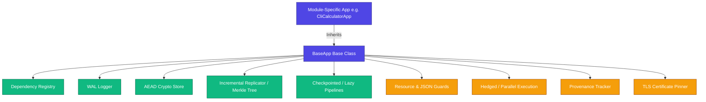
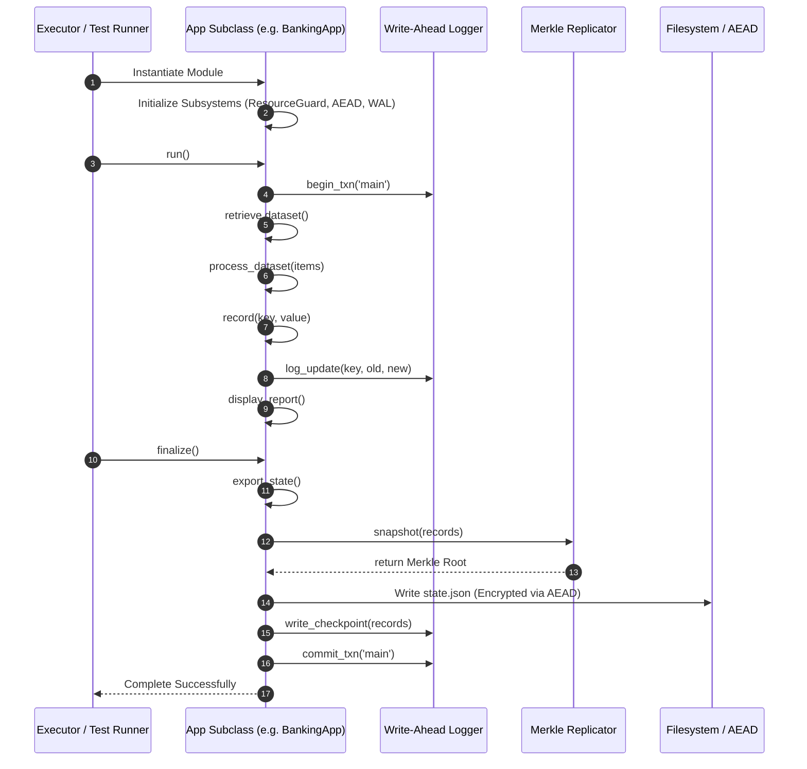

# 🏛️ Repository Architecture Overview

Welcome to the **45-Days-Python-Development-Challenge** Architecture Overview. This guide provides developers, contributors, and maintainers with a complete structural blueprint of the repository, explaining its design patterns, subsystem collaborations, and code execution lifecycles.

---

## 📖 Table of Contents

1. [High-Level System Design](#1-high-level-system-design)
2. [Folder Structure](#2-folder-structure)
3. [The Core Class: `BaseApp`](#3-the-core-class-baseapp)
4. [Subsystem Collaborations](#4-subsystem-collaborations)
   - [Dependency Injection & decoupled resolution](#dependency-injection--decoupled-resolution)
   - [State Integrity & Verification (Merkle Trees)](#state-integrity--verification-merkle-trees)
   - [Transaction Safety (Write-Ahead Logging)](#transaction-safety-write-ahead-logging)
   - [Security & Input Sandboxing](#security--input-sandboxing)
   - [Pipeline Operations & Processing](#pipeline-operations--processing)
   - [Provenance Tracking (Data Audits)](#provenance-tracking-data-audits)
5. [Application Execution Lifecycle](#5-application-execution-lifecycle)
6. [Architectural Design Principles](#6-architectural-design-principles)

---

## 1. High-Level System Design

The repository is built around a **unified, component-driven architecture**. Each project or challenge is treated as a self-contained application module implementing standard interfaces. Rather than being isolated, chaotic scripts, modules leverage a robust, shared framework of enterprise services (cryptography, logging, security, concurrency, and validation).



---

## 2. Folder Structure

The repository maintains a clean separation of configuration, source modules, learning resources, and tests.

```bash
45-DAYS-PYTHON-DEVELOPMENT-CHALLENGE
│
├── .github/                     # GitHub Actions CI/CD workflows
├── .project-docs/               # Centralized documentation folder
│   ├── ARCHITECTURE.md          # ◄ You are here (Core Architecture Guide)
│   ├── INSTALL.md               # Environment Setup Guide
│   ├── LEARN.md                 # Daily Learning Guide
│   ├── ROADMAP.md               # Repository Milestones
│   └── TODO.md                  # Task Board
│
├── MAIN_CODE_PROJECT/           # Primary Development Workspace
│   ├── src/                     # Core reusable modules and engine components
│   │   ├── __init__.py          # Source path setup & registry imports
│   │   ├── base_app.py          # The core BaseApp definition
│   │   ├── contracts.py         # Abstract base protocols / interfaces
│   │   ├── dependency_registry.py # String-based dynamic dependency injection
│   │   └── [100+ module files]  # Algorithms, utilities, and security libraries
│   │
│   ├── tests/                   # Automated Unit & Integration Tests
│   └── week-*/day-*             # Organized daily challenges and practice scripts
│
├── STUDY_MATERIALS_RESOURCES/   # Informational guides & learning resources
│
├── environment.yml              # Conda environment definition
├── pytest.ini                   # Pytest test suite configuration
└── README.md                    # Repository Landing & Orientation Page
```

---

## 3. The Core Class: `BaseApp`

Located in `MAIN_CODE_PROJECT/src/base_app.py`, [BaseApp](file:///c:/Users/Sujal/PROJECTS/NSOC_OS_5/45-Days-Python-Development-Challenge/MAIN_CODE_PROJECT/src/base_app.py) is the foundation of the entire workspace. It enforces the implementation of three key abstract interfaces (Protocols) defined in `contracts.py`:

*   **`DataProvider`**: For modules that yield sample datasets via `demo_data()`.
*   **`DataProcessor`**: For modules that ingest and transform datasets via `process_dataset(items)`.
*   **`AppRunner`**: For modules with an entry point execution flow via `run()`.

By standardizing these interfaces, any testing framework or subagent can orchestrate and validate any module in the repository uniformly.

---

## 4. Subsystem Collaborations

### Dependency Injection & Decoupled Resolution

To prevent circular imports—a common issue in growing Python repositories—modules communicate via string keys in the `DependencyRegistry` singleton rather than importing one another directly.

1.  **Register**: Concrete subclasses register themselves with the registry:
    ```python
    DependencyRegistry.register("banking_simulation", BankingSimulationApp())
    ```
2.  **Resolve**: Other modules resolve the dependency lazily:
    ```python
    bank = DependencyRegistry.resolve("banking_simulation")
    ```

### State Integrity & Verification (Merkle Trees)

Applications track operational state under `BaseAppState`. To ensure that state updates cannot be tampered with or corrupted:
*   An `IncrementalStateReplicator` uses a **Merkle Tree** (`merkle_tree.py`) to hash the application records.
*   Every change updates the tree root.
*   State dumps include the Merkle Root, which can be verified offline against the actual records.

### Transaction Safety (Write-Ahead Logging)

State changes are wrapped in transaction boundaries:
*   Before updating state, updates are appended to a **Write-Ahead Log** (`wal_logger.py`).
*   In the event of a crash during execution, the database/records can recover to a clean checkpoint by replaying the WAL logs.

### Security & Input Sandboxing

The codebase utilizes multiple guard layers to guarantee secure operations:
*   **`AEADStore`**: Implements Authenticated Encryption with Associated Data (using AES-GCM or equivalent cryptographic constructs) to protect state serialized to files.
*   **`ResourceGuard`**: Prevents directory traversal attacks by validating that all read/write file paths remain strictly within approved output directories.
*   **`JsonDepthGuard`**: Enforces strict validation of JSON nesting limits, protecting the Python stack against recursion-based denial of service.

### Pipeline Operations & Processing

Complex data workflows are organized using structured pipelines:
*   **`CheckpointedPipeline`**: Executes sequence stages, saving progress along the way. If a step fails, execution can resume from the last successful checkpoint instead of restarting from scratch.
*   **`LazyPipeline`**: A stream processor implementing lazy evaluation to manipulate streams without holding complete datasets in memory.
*   **`AdaptiveBatchProcessor`**: Dynamically adjusts batch sizing based on processing time history, maximizing throughput under volatile resource allocations.

### Provenance Tracking (Data Audits)

The `_provenance` component tracks data lineage following W3C PROV standards. It documents:
*   **Entities**: Data artifacts (such as state files or calculated results).
*   **Activities**: Functions or methods executed.
*   **Agents**: Users or calling modules.

This generates a fully traceable audit graph that shows *how* any piece of data was derived.

---

## 5. Application Execution Lifecycle

When an execution framework (or runner) invokes a module subclassing `BaseApp`, the execution proceeds through a strict lifecycle sequence:



---

## 6. Architectural Design Principles

The design of the repository codebase strictly adheres to the following industry standards:

1.  **Single Responsibility Principle (SRP)**: Engine helpers (e.g., path validation, encryption, thread scheduling) are isolated in separate files inside `src/`. `BaseApp` integrates them but does not define their implementation.
2.  **Interface Segregation / Liskov Substitution**: Modules communicate through interfaces (`Protocol` classes in `contracts.py`). Any module inheriting `BaseApp` can be substituted wherever a contract is expected.
3.  **Security by Design**: Files are not written in plaintext; cryptography, depth limitations on parsers, and strict bounds on path traversal are enabled by default at the framework level.
4.  **Fail-Safe Architecture**: Long-running processes support checkpoints and Write-Ahead logs to ensure consistency and crash-recovery.
