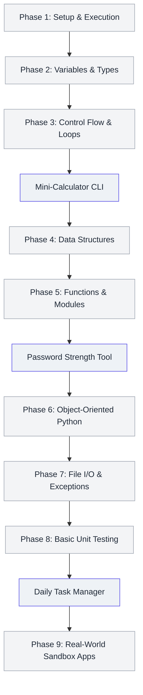

# 🐍 Beginner-Friendly Python Learning Roadmap

Welcome to the **45-Days-Python-Development-Challenge** Python Learning Roadmap! This document is designed as a structured, step-by-step path for absolute beginners. It takes you from installing Python to mastering advanced software design patterns, using the hands-on projects in this repository as your practice ground.

---

## 🗺️ Roadmap at a Glance



---

## 🎯 Phase 1: Setup & "Hello World"

Learn how to configure your development environment and run your first Python script.

### 🔑 Key Concepts
*   Downloading and installing Python 3.10+ (Check via `python --version`).
*   Configuring a virtual environment (`venv`) to keep project dependencies isolated.
*   Writing and running a script from your command prompt/terminal.

### 📝 Practical Example
Navigate to [hello.py](file:///c:/Users/Sujal/PROJECTS/NSOC_OS_5/45-Days-Python-Development-Challenge/STUDY_MATERIALS_RESOURCES/PYTHON_BASICS/hello.py) in the codebase.
```python
# Save this in a file named hello_world.py
def main():
    print("Hello, Python Challenger!")

if __name__ == "__main__":
    main()
```
Run this script:
```bash
python hello_world.py
```

---

## 🎯 Phase 2: Variables, Data Types & Operators

Learn how Python stores information in variables and performs math or logical checks.

### 🔑 Key Concepts
*   **Primitive Types**: Integers (`int`), Floats (`float`), Strings (`str`), and Booleans (`bool`).
*   **Basic Arithmetic Operators**: Addition `+`, Subtraction `-`, Multiplication `*`, Division `/`, Floor Division `//`, Modulus `%`, Exponentiation `**`.
*   **Logical Operators**: `and`, `or`, `not`.

### 📝 Practical Example
```python
# Variable declarations & type annotations (PEP 484)
days_remaining: int = 45
temperature: float = 38.5
is_raining: bool = False
greeting: str = "Welcome to Day 1"

# Calculations
seconds_in_day: int = 24 * 60 * 60
print(f"{greeting}! There are {seconds_in_day} seconds in a day.")
```

---

## 🎯 Phase 3: Control Flow & Loops

Make your code dynamic and perform repetitive tasks efficiently using conditional logic and iteration blocks.

### 🔑 Key Concepts
*   **Conditionals**: `if`, `elif`, `else` blocks to control execution.
*   **Loops**: `for` loops (best when iterating over collections or ranges) and `while` loops (best when looping until a condition changes).
*   **Loop Modifiers**: `break` (exit loop), `continue` (skip current iteration), and `pass` (placeholder block).

### 📝 Practical Example
```python
# Simple FizzBuzz loop
for number in range(1, 21):
    if number % 15 == 0:
        print("FizzBuzz")
    elif number % 3 == 0:
        print("Fizz")
    elif number % 5 == 0:
        print("Buzz")
    else:
        print(number)
```

---

## 🎯 Phase 4: Core Data Structures

Master the collections that Python uses to manage lists of data, maps, and unique elements.

### 🔑 Key Concepts
*   **Lists**: Ordered, mutable arrays (e.g. `[1, 2, 3]`). Support list comprehensions: `[x*x for x in range(5)]`.
*   **Tuples**: Ordered, immutable arrays (e.g. `(width, height)`). Ideal for constant values or structured records.
*   **Dictionaries**: Key-value mappings (e.g. `{"username": "alice", "admin": True}`). Fast O(1) lookups.
*   **Sets**: Unordered, unique elements (e.g. `{1, 2, 3}`). Perfect for removing duplicates.

### 📝 Practical Example
```python
# Creating and manipulating data structures
challenge_goals = ["Learn Python", "Build Calculator", "Create APIs"]
challenge_goals.append("Deploy App")

user_scores = {"Day 1": 100, "Day 2": 95, "Day 3": 98}
print(f"Scores obtained: {list(user_scores.values())}")

# List comprehension: Double only the even scores
doubled_evens = [score * 2 for score in user_scores.values() if score % 2 == 0]
print(f"Doubled even scores: {doubled_evens}")
```

---

## 🎯 Phase 5: Functions, Type Hints & Modules

Write clean, reusable blocks of code and divide your program into organized files.

### 🔑 Key Concepts
*   **Function Definition**: Use `def` keyword, define parameters, write docstrings, and specify return values.
*   **Type Hinting**: Improving readability by declaring input/output types (e.g. `name: str -> str`).
*   **Scope**: Differentiating local variables from global module scopes.
*   **Standard Modules**: Importing built-in utility modules (`math`, `json`, `datetime`, `pathlib`).

### 📝 Practical Example
```python
from datetime import datetime

# A well-documented, type-hinted function
def get_days_until(target_date_str: str) -> int:
    """Calculate the number of days from today until a target date."""
    target = datetime.strptime(target_date_str, "%Y-%m-%d")
    delta = target - datetime.utcnow()
    return delta.days

print(f"Days left to finish: {get_days_until('2026-06-30')} days")
```

---

## 🎯 Phase 6: Object-Oriented Python (OOP)

Organize code by wrapping variables (attributes) and functions (methods) into cohesive blue-prints called Classes.

### 🔑 Key Concepts
*   **Classes & Objects**: Constructing classes with the `__init__` constructor method.
*   **Methods**: Passing `self` to reference the specific instance object.
*   **Inheritance**: Reusing code by extending base parent classes (e.g. inheriting from `BaseApp`).
*   **Encapsulation**: Denoting private variables with a leading underscore `_` (e.g., `_my_private_var`).

### 📝 Practical Example
```python
class Task:
    def __init__(self, title: str, difficulty: int) -> None:
        self.title = title
        self.difficulty = difficulty
        self.completed = False

    def complete(self) -> None:
        self.completed = True

# Instantiate class object
day_1_task = Task("Complete Python Setup", difficulty=1)
day_1_task.complete()
print(f"Task: {day_1_task.title} | Completed? {day_1_task.completed}")
```

---

## 🎯 Phase 7: Exception Handling & File I/O

Ensure your application is robust by catching runtime errors gracefully and saving data to files.

### 🔑 Key Concepts
*   **Robust Errors**: Catching crashes using `try`, `except`, `finally`, and raising exceptions using `raise`.
*   **File Reading/Writing**: Using the context manager statement `with open(...)` to guarantee resources are closed safely.

### 📝 Practical Example
```python
from pathlib import Path

file_path = Path("user_tasks.txt")

# Writing to a file
with open(file_path, "w", encoding="utf-8") as writer:
    writer.write("1. Setup environment\n2. Run hello.py\n")

# Reading and handling potential file errors
try:
    with open(file_path, "r", encoding="utf-8") as reader:
        content = reader.read()
        print(content)
except FileNotFoundError:
    print("Warning: Task file could not be found.")
except Exception as err:
    print(f"An unexpected error occurred: {err}")
```

---

## 🎯 Phase 8: Unit Testing Fundamentals

Verify your code is correct and protect it against future regression breaks by writing tests.

### 🔑 Key Concepts
*   **Assertions**: Evaluating expressions that must be true (e.g. `assert add(2, 3) == 5`).
*   **Pytest Framework**: Writing simple `test_` prefixed files and executing them automatically.

### 📝 Practical Example
```python
# Save this file inside tests/test_simple_math.py
def add_one(value: int) -> int:
    return value + 1

def test_add_one():
    assert add_one(5) == 6
    assert add_one(-1) == 0
```
Run tests in your project using:
```bash
pytest tests/
```

---

## 🏁 Suggested Learning Projects Checklist

Now that you know the fundamentals, put them to the test by creating or contributing to these modules located inside `MAIN_CODE_PROJECT/src/`:

- [ ] **Calculator App** ([cli_calculator.py](file:///c:/Users/Sujal/PROJECTS/NSOC_OS_5/45-Days-Python-Development-Challenge/MAIN_CODE_PROJECT/src/cli_calculator.py))
  *   *Focus*: Operators, input loops, math operations.
- [ ] **Password Strength Analyzer** ([password_strength_analyzer.py](file:///c:/Users/Sujal/PROJECTS/NSOC_OS_5/45-Days-Python-Development-Challenge/MAIN_CODE_PROJECT/src/password_strength_analyzer.py))
  *   *Focus*: String manipulations, character sets, boolean validations.
- [ ] **Task Manager** ([task_management.py](file:///c:/Users/Sujal/PROJECTS/NSOC_OS_5/45-Days-Python-Development-Challenge/MAIN_CODE_PROJECT/src/task_management.py))
  *   *Focus*: CRUD lists, dictionary collections, state updates.
- [ ] **Custom Module App**
  *   *Focus*: Inheriting `BaseApp`, registering dependencies, implementing `process_dataset`.
